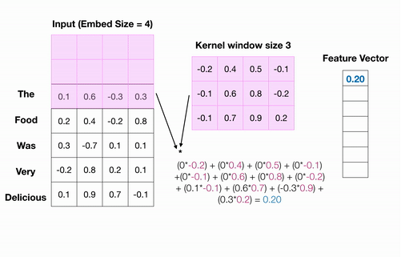

# Convolutional Sequence to Sequence Learning

Recurrent neural networks (RNNs) with LSTM or GRU units are the most prevalent tools for NLP researchers, and provide state-of-the-art results on many different NLP tasks, including language modeling (LM), neural machine translation (NMT), sentiment analysis, and so on. However, a major drawback of RNNs is that since each word in the input sequence are processed sequentially, they are slow to train.

Most recently, Convolutional Neural Networks - traditionally used in solving most of Computer Vision problem, have also found prevalence in tackling problems associated with NLP tasks like Sentence Classification, Text Classification, Sentiment Analysis, Text Summarization, Machine Translation and Answer Relations.

Back in 2017, a team of researchers from Facebook AI research released an interesting paper about [Sequence to Sequence learning with Convolutional neural networks(CNNs)](https://arxiv.org/pdf/1705.03122.pdf), where they tried to apply CNNs to problems in Natural Language Processing. 

In this notebook, I’ll try to summarize this paper on how CNN's are being used in machine translation. 

## What are Convolutional Neural Networks and their effectiveness for NLP?

Convolutional Neural Networks (CNNs) were originally designed to perform deep learning for computer vision tasks, and have proven highly effective. They use the concept of a “convolution”, a sliding window or “filter” that passes over the image, identifying important features and analyzing them one at a time, then reducing them down to their essential characteristics, and repeating the process.

Now, lets see how CNN process can be applied to NLP

Neural networks can only learn to find patterns in numerical data and so, before we feed a text into a neural network as input, we have to convert each word into a numerical value. It starts with an input sentence broken up into words and transformed to word embeddings - low-dimensional representations generated by models like word2vec or GloVe or by embedding layer. The text is organized into a matrix, with each row representing a word embedding for the word. The CNN’s convolutional layer “scans” the text like it would an image, breaks it down into feature. 

The following image illustrates how the convolutional “filter” slides over a sentence, three words at a time. This is called a 1D convolution because the kernel is moving in only one dimension. It computes an element-wise product of the weights of each word, multiplied by the weights assigned to the convolutional filter.The resultant output will be a feature vector that contains about as many values as there were in input embeddings, so the input sequence size does matter. 

A convolutional neural network will include many of these kernels (filters), and, as the network trains, these kernel weights are learned. Each kernel is designed to look at a word, and surrounding word(s) in a sequential window, and output a value that captures something about that phrase. In this way, the convolution operation can be viewed as window-based feature extraction.

# How convolutional sequence to sequence model work?

An architecture proposed by authors for sequence to sequence
modeling is entirely convolutional.
Below diagram outlines the structure of convolutional sequence to sequence model.

Like any RNN based sequence to sequence structure CNN based model uses encoder decoder architecture, however here both encoder and decoder are composed of stacked convolutional layers with a special type of activation function called Gated Linear Units. In the middle there is a attention function. The encoder extracts features from the source sequence, while decoder learns to estimate the function that maps the encoders hidden state and its previous generated words to the next word. The attention tells the decoder which hidden states of the encoder to focus on. 

